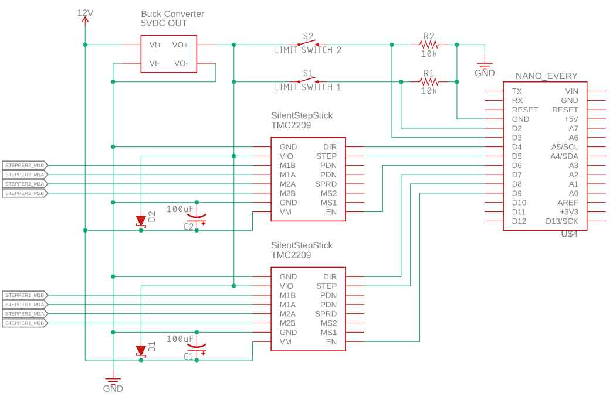

# Arduino-multi-stepper
Control multiple stepper motors using an arduino.

### Table of Contents
1. [Getting Started](#getting-started)
    - [Requirements](#requirements)
    - [Setup and Installation](#setup-and-installation)
        - [Stepper Driver Setup](#stepper-driver-setup)
2. [Usage](#usage)
    - [Commands](#commands)
3. [Materials](#materials)
4. [Wiring Scheme](#wiring-scheme)
5. [License](#license)

## Getting Started
### Requirements
The following arduino libraries are used:
- AccelStepper
  
### Setup and Installation
Make relevant modifications and upload the sketch to your arduino.

Here's what you may need to modify (for each motor) based on your specific application:
- Pin assignments (for stepper drivers and limit switches)
- The following are coded in, but are planned to be changeable with commands:
  - (max)MotorSpeed
  - (max)MotorAccel
- stepsPerRev, steps per revolution (e.g. 1/8 microstepping on a 1.8 deg (200 step) motor is 1600 steps)
- distPerRev, distance per revolution for your motion system. (e.g. motor directly coupled to a 2 mm pitch/4 start lead screw = 8 mm distance per rev)
- min and maxPosition
- isForwardCCW, whether counter clock-wise (looking from motor to shaft end) is considered forward (positive) motion. (May be reversed for you stepper driver)
- disableWhenStill, depower the motor when not moving. Steppers generate heat when actively holding position. This will disable that but the motor can be turned by an external force (which may be desirable in some cases).
- setPinsInverted arguments in setup(), this depends on your stepper driver.
- Serial baudrate

#### Stepper Driver Setup
This project uses the TMC2209 SilentStepStick which is a drop-in replacement for the common A4988 driver. You may need to change the setPinsInverted arguments depending on your stepper driver.

Regardless of your driver, you will need to set the motor current by adjusting a potentiometer on the driver board. This depends on both your driver and stepper motor specs. Depending on your current setting you may also need to apply a heatsink to your driver.

## Usage
The arduino parses its serial buffer for commands. If the command is valid it then executes it. 
To send commands you will need to connect the arduino to a usb port and use a program like Arduino Serial Monitor or PuTTY to send commands.
Each command must have a header and foot character to indicate the beginning and end of your message. By default these are ">" and "\n", respectively, but can be changed.
For a list of commands see below. The arduino can also report relevant info like current position and when a move is completed.

Instead of sending manual commands like above, you can automate the device or use it as part of a larger program. This can be done for example with PySerial.
A Python module for controlling this specific arduino stepper controller and using it in combination with other devices for lab automation is available here:
[add link]

If you want to develop your own software package then the communication protocol is as follows:

Host sends a command to the arduino:

- If the command is valid, the arduino responds "ACK" + and optional message
- If the command is invalid, the arduino responds "NAK  + and optional message

Then the arduino proceeds to execute the command.
- If the action was performed successfully, the arduino responds with "SUCC"  + and optional message
- If the action encountered a problem, the arduino responds with "FAIL"  + and optional message.

The arduino response characters can be changed in the sketch to any char(s) or byte(s) you want, such as "\x06" for ACK.

### Commands

To add all commands and descriptions here

## Materials
Current design uses 2 NEMA 17 stepper motors but is generalizable to 1 stepper or many more steppers. You can add more steppers as long as you have appropriate power supply.

Here are the materials you will need. The specific components I used are indicated in parenthesis.
- Arduino microcontroller (Uno)
- Stepper motor(s), 4 wire bipolar (stepperonline NEMA 17, s/n: 17HS08-1004S)
- Stepper driver per motor (TMC2209 SilentStepStick)
- Limit switch for homing per motor, normally closed (ServoCity Micro Limit Switch (Bump Lever))
- Pull-down resistors for limit switches (10kOhm)
- Decoupling capacitor for stepper driver Vm and Gnd (100 uF, this is well documented online)
- Schottky diodes (for [SilentStepSticks with variable 3-5V logic voltage](https://learn.watterott.com/silentstepstick/pinconfig/))
- Power supply for the stepper motors, 12V+ (this is not the voltage rating of your stepper, use 12V atleast with sufficient current)
  - A stepper motor still draws current when it is not moving, so keep this in mind when sizing systems with multiple steppers.
- Logic power supply, 5V
  - You can use a regulator or buck converter to step down your motor supply voltage. (I used a DFR0571 buck converter).

## Wiring Scheme

## License
To add
